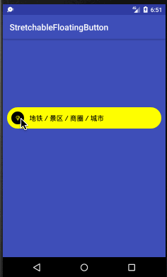
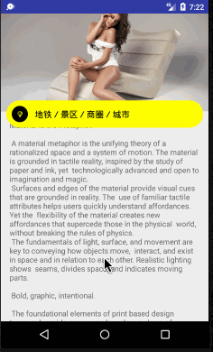

### 可折叠按钮

[源码解析](library/README.md)

效果图展示：

 

#### 导入

**Gradle 添加依赖**

```Groovy
allprojects {
    repositories {
	...
	maven { url 'https://jitpack.io' }
    }
}
```

在项目中的build.gradle中添加

```Groovy
dependencies {
    compile 'com.github.CTSN:FlodAbleButton:1.1'
}
```

### 使用

**属性了解**

```
app:bac_color="#ff0"  				//背景颜色
app:close_icon="@mipmap/icon_2"  		//关闭图标
app:inner_circle_color="@color/black"		//小圆颜色
app:open_icon="@mipmap/icon"			//展开图标
app:speed="100"					//折叠速度
app:text="地铁／景区／商圈／城市"		       //文本
app:text_color="@color/black"			//字体颜色
app:text_size="16"				//字体大小
app:degrees="90"				//旋转角度
```

**在xml中使用**

```Xml
<com.roy.library.FlodableButton
        android:id="@+id/fb"
        android:layout_width="match_parent"
        android:layout_height="60dp"
        android:layout_margin="10dp"
        app:bac_color="#ff0"
        app:close_icon="@mipmap/icon_2"
        app:inner_circle_color="@color/black"
        app:open_icon="@mipmap/icon"
        app:speed="100"
        app:text="地铁／景区／商圈／城市"
        app:text_color="@color/black"
        app:text_size="16"
        app:degrees="90"/>
```

**折叠监听回调**

```Java
fb.setFoldListener(new FlodableButton.FoldListener() {
    @Override
    public void onFold(boolean isIncrease, FlodableButton sfb) {
        String text = isIncrease? "展开了":"折叠了";
        Toast.makeText(MainActivity.this,text,Toast.LENGTH_SHORT).show();
    }
});
```

**点击监听**

```Java
fb.setOnClickListener(new FlodableButton.OnClickListener() {
    @Override
    public void onClick(FlodableButton sfb) {
        fb.startScroll();
    }
});
```

<font color="red">注意：必须使用自己的点击监听</font>

## License

```
Copyright 2017 CTSN

Licensed under the Apache License, Version 2.0 (the "License");
you may not use this file except in compliance with the License.
You may obtain a copy of the License at

    http://www.apache.org/licenses/LICENSE-2.0

Unless required by applicable law or agreed to in writing, software
distributed under the License is distributed on an "AS IS" BASIS,
WITHOUT WARRANTIES OR CONDITIONS OF ANY KIND, either express or implied.
See the License for the specific language governing permissions and
limitations under the License.
```
