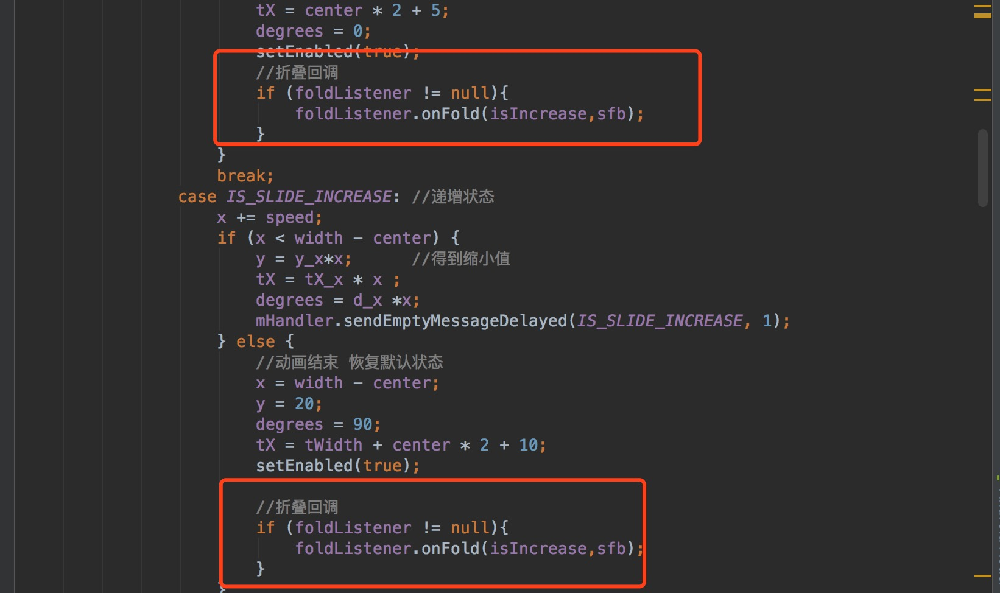
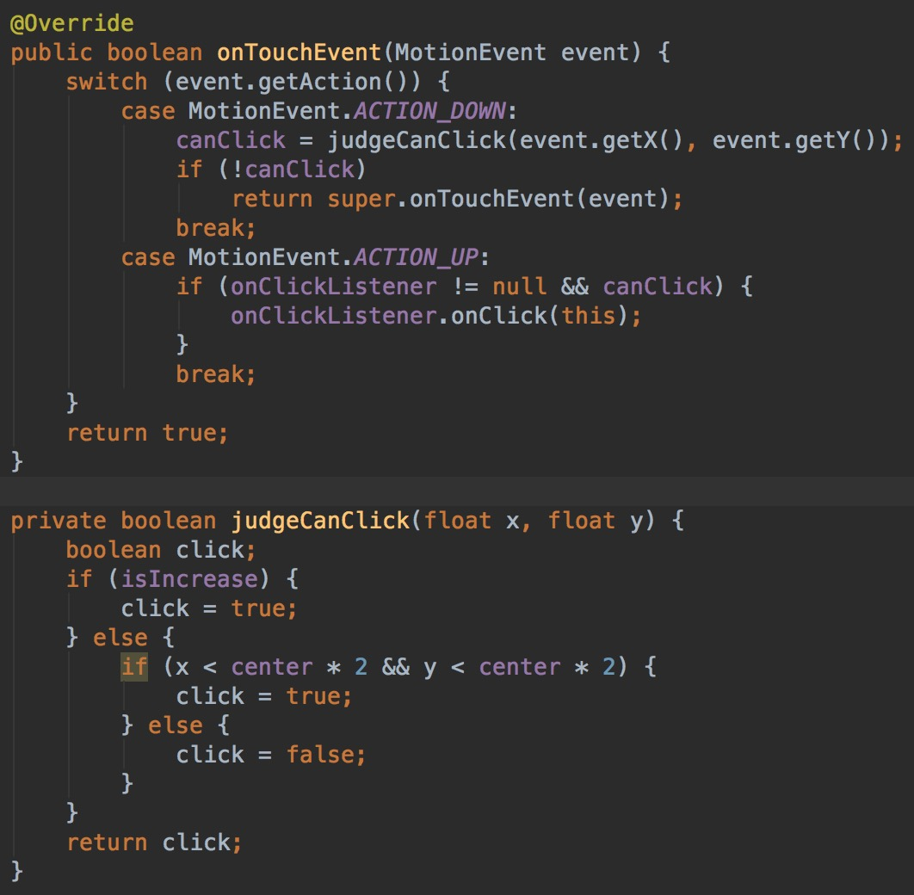

## 自定义可折叠按钮
这几天无聊系列之-------自定义可折叠浮动按钮

效果如下：


注意看到没，有个浮动按钮，上滑到顶缩小，下滑到某个地方就展开。暂且不说上拉跟下滑的时候。主要时按钮伸缩效果如何实现呢？这个就是我们今天的主题了。
## 思路分析
### 一、按钮拉伸思路步骤详解

如下(绘画的很粗糙，忽略)：


主要是由两个圆，然后中间是一个矩形。当按钮缩小时，就是右边这个圆向左边这个圆靠近，圆心不断向左移,中间矩形宽度不断减少,可以看到矩形的宽度就是右边圆圆心的x坐标减去左边圆心x坐标

开始动手撸代码。

**1.创建一个叫StretchableFloatingButton的类并且继承ViewGroup,并实现相应的方法。**


**2.在onMeasure方法终测量控件的宽高度，以及圆心半径，矩形右边的x坐标。**

```Java
@Override
protected void onMeasure(int widthMeasureSpec, int heightMeasureSpec) {
	if (width == 0){
	    width = MeasureSpec.getSize(widthMeasureSpec);
	    height = MeasureSpec.getSize(heightMeasureSpec);
	
	    //获取圆的半径
	    center = height/2;
	    //矩形右边x坐标
	    x = width -center;
	
	}
	super.onMeasure(widthMeasureSpec, heightMeasureSpec);
}
```
**3.确定左边圆圆心，右边圆圆心，以及矩形范围，并绘制出来。(**注意ViewGroup绘制在dispatchDraw方法里**)**

- 左边圆心：（center，center）半径为center
- 右边圆心：（width-center,center） 半径为center
- 矩形范围(RectF)确定左上角和右下角坐标：（center,0,width-center,height）

```Java
@Override
protected void dispatchDraw(Canvas canvas) {
    //画左边圆
    canvas.drawCircle(center, center, center, paint);

    //画矩形
    rectF = new RectF(center, 0, width-center, height);
    canvas.drawRect(rectF, paint);

    //画右边圆
    canvas.drawCircle(width-center, center, center, paint);

    super.dispatchDraw(canvas);
}
```
**4.在布局中引用，看效果**


**5.实现缩小和展开效果**

在上面我们分析到，缩小（展开），是右边圆心不断向左边靠近(远离)；矩形宽度缩小（变大），也就是右边圆心x坐标不断减小（增大），达到位置时动画就结束。


- 改变的就是矩形范围（center,0,x,height），x 就是我们减小（增大）的值。
- 右边圆（x,center）,x跟矩形x一致。

如何不断减小（增大）x的值？ 

我们可以通过handler不断发送消息，减少（增加）x的值并重绘，当x到达左边圆心x坐标或到达矩形右边原本x坐标位置，停止发送。


定义一个方法让外部调用


看实现效果：


### 二、内部小圆放大缩小思路步骤详解
**1.先把小圆绘制出来。**

- 确定圆心位置，跟左边的圆圆心一致
- 小圆半径为centet-y，这里y指的是**圆环宽度**，设置初始值为20，等下我们要操作的圆环宽度y，来控制小圆的变化。


效果如下：


**2.当整个控件放大缩小时控制圆的缩小和放大**

这里要确定个比值：小圆最小时距离左边圆的宽度是固定 我们设为y，而控件减小或增大的距离也是确定的，我们设为x。当出现变化时，x减少多少，y就根据**x/y**这个比值减少多少。

**y／x = 圆环最大宽度／控件拉伸总距离**

- 在onMesure中确定这个比值


- 在控件拉伸活着放大时，的到具体的y值。


效果如下：


### 三、内部文字拉伸思路步骤详解
在考虑文字拉伸的时候如果用canvas 画文字，控制拉伸比较难控制，所以这个控件是继承ViewGroup。默认我在里面写了个TextView，通过onLayout去控制文本宽度。

**1.创建一个TextView,并在onMesaure中测量宽高度。**


**2.通过onLayout摆放TextView位置。确定两个坐标左上角，右下角坐标**


- 左上角（ceter*2 +5，center-tHeight/2），+5的目的是设置间距

- 右下角 (tWidth + center*2+10,(center+tHeight/2)) +10设置间距


注:**tX** 在后面代码中来控制文本宽度。默认初始为 **tX = tWidth + center\*2+10**

效果如下：


**3.设置TextView文本宽度变化比，其实就是TextView右下角的x坐标值的大小，达到拉伸目的。**


TextView最大拉伸距离就是自身，控件拉伸距离在上面我们也已经确定是矩形的宽度。当控件拉伸多少根据这个比值，TextView对应拉伸的距离，即我我们所要求的tX。

确定比值：**TextView最大宽度／控件拉伸总距离**


根据比值得到tX,因为是改变子控件位置，需要调用requestLayout方法


效果如下：


### 四、小圆中图片旋转思路步骤详解

最终到了我们这个控件的最后一个思路环节了。就是小图标的旋转以及变化，在原效果中，当控件拉伸时，小图标跟着旋转，并且在效果结束之后变换图片。

这里涉及到了canvas的drawBitamp方法，以及canvas的roatate旋转方法。

**1.先把小图标画出来。**

- 确定小图标宽高度，这里我设置了固定值：小圆的半径 - 5，-5设置间距。

	
	
- 确定小图标左上角坐标位置。（center - iconWidth / 2，center - iconWidth / 2）


效果如下：


**2.处理旋转，这里我设置默认旋转90度。因为原效果折叠时是逆时针旋转所以是-90度。**

同样的我们也是要求出旋转比。根据旋转比得出旋转值。

旋转比： **总旋转角度／控件拉伸距离**


**3.根据旋转比求出旋转角度**


最终效果如下：


## 优化

### 一、设置自定义属性
我们写了这么多，里面的角度，图标，文字，颜色等等都是固定的，应该可以在xml代码中动态去设置它。

这里需要写自定义属性，在valuse文件夹创建一个attrs的XML文件，编写自定义属性

```Xml
<?xml version="1.0" encoding="utf-8"?>
<resources>
    <declare-styleable name="FlodableButton">
        <!--字体大小-->
        <attr name="text_size" format="float"/>
        <!--折叠速度-->
        <attr name="speed" format="float"/>
        <!--控件背景颜色-->
        <attr name="bac_color" format="color"/>
        <!--字体颜色-->
        <attr name="text_color" format="color"/>
        <!--小圆颜色-->
        <attr name="inner_circle_color" format="color"/>
        <!--文本-->
        <attr name="text" format="string"/>
        <!--展开图标-->
        <attr name="open_icon" format="reference"/>
        <!--挂壁图标-->
        <attr name="close_icon" format="reference"/>
        <!--图标旋转角度-->
        <attr name="degrees" format="float"/>
    </declare-styleable>
</resources>
```

在代码中获取自定义属性值


在xml中使用

```Xml
<?xml version="1.0" encoding="utf-8"?>
<LinearLayout
    xmlns:android="http://schemas.android.com/apk/res/android"
    xmlns:tools="http://schemas.android.com/tools"
    xmlns:app="http://schemas.android.com/apk/res-auto"
    android:layout_width="match_parent"
    android:layout_height="match_parent"
    android:background="@color/colorPrimary"
    tools:context="com.roy.stretchablefloatingbutton.MainActivity">
    
    <com.roy.library.FlodableButton
            android:id="@+id/fb"
            android:layout_width="match_parent"
            android:layout_height="60dp"
            android:layout_margin="10dp"
            app:bac_color="#ff0"
            app:close_icon="@mipmap/icon_2"
            app:inner_circle_color="@color/black"
            app:open_icon="@mipmap/icon"
            app:speed="60"
            app:text="地铁／景区／商圈／城市"
            app:text_color="@color/black"
            app:text_size="16"
            app:degrees="90"/>

</LinearLayout>

```

### 二、设置折叠监听事件

当控件折叠或者展开成功时，设置一个监听事件，把折叠状态以及控件自身回调出去

```Java
public void setFoldListener(FoldListener foldListener) {
    this.foldListener = foldListener;
}

//折叠展开监听
public interface FoldListener{
    void onFold(boolean isIncrease,StretchableFloatingButton sfb);
}
```



使用

```Java
sfb.setFoldListener(new FlodableButton.FoldListener() {
    @Override
    public void onFold(boolean isIncrease, FlodableButton sfb) {
        String text = isIncrease? "展开了":"折叠了";
        Toast.makeText(MainActivity.this,text,Toast.LENGTH_SHORT).show();
    }
});
```
效果展示


### 三、设置自己的点击监听事件

本来有自己的点击事件，为什么也要设置自己的点击事件呢。原因如下：

 
 
 在效果可以看到，当我们折叠时，点击空白处，还有点击事件响应，这是我们不需要的。
 这个效果出现的原因是我们的控件设置宽度是**match_parent**,所以一般设置点击事件还是会响应。
 
 **如何解决这个问题呢？**
 
我们可以在onTouchEvent事件中做拦截,这里我们要区分两种状况：

 - 折叠状态时，可点击区域是个圆，需要判断点击的时的 x坐标和y坐标是否在圆内。在圆内响应点击事件，不在圆内不做拦截处理。
 - 伸展状态时，可点击区域时整个控件。

 代码如下：
 


在Activity中使用

```Java
sfb.setOnClickListener(new FlodableButton.OnClickListener() {
	@Override
	public void onClick(FlodableButton sfb) {
    	//点击事件处理
	}
}
```

效果展示


最后展示下最终的完成效果


